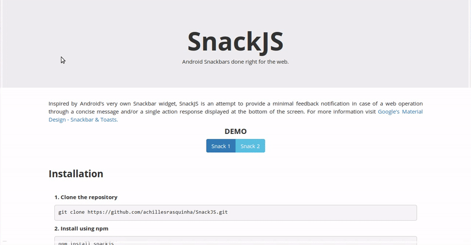

# SnackJS
> Android Snackbars done right for the web.

[]()
[](https://www.npmjs.com/package/snackjs)
[](https://www.npmjs.com/package/snackjs)
[](https://www.npmjs.com/package/snackjs)
[](https://github.com/achillesrasquinha/SnackJS)
[](http://github.com/achillesrasquinha/SnackJS/blob/master/LICENSE)



Inspired by Android's very own Snackbar widget, SnackJS is an attempt to provide a minimal feedback notification in case of a web operation through a concise message and/or a single action response displayed at the bottom of the screen. For more information visit [Google's Material Design - Snackbar &amp; Toasts](https://material.google.com/components/snackbars-toasts.html). Check out the [project page](https://achillesrasquinha.github.io/SnackJS) for demos.

### Table of Contents
* [Installation](#installation)
* [Usage](#usage)
* [Methods](#methods)
* [Options](#options)
* [License](#license)

### Installation
##### Clone the repository
```
git clone https://github.com/achillesrasquinha/SnackJS.git
```

##### Install using npm
```
npm install snackjs
```

##### Install using bower
```
bower install snackjs
```

In your HTML file
```html
<!DOCTYPE html>
<html>
  <head>
    ...
    <link rel="stylesheet" href="/path/to/snackjs.css">
  </head>
  <body>
    ...
    <script src="/path/to/snack.js"></script>
  </body>
</html>
```

### Usage
A template declaration would be as follows
```javascript
var snack = Snack.make("<your_message>", { /*<your_options>*/ });
snack.show();
```

For example
```javascript
// Message-Only Snack
Snack.make("This is a Snack.").show();

// Message + Action Snack
Snack.make("This is a Snack with an action.", {
    action  : 'Okay',
    onAction: function ( ) {
        alert("Success!");
    }
}).show();
```

Or maybe a chain call
```javascript
var snack = new Snack();
snack.message ("Luke, I'm your father.")
     .settings({ duration: Snack.LONG, hideOnClick: true })
     .show();
```

### Methods
| Return        | Method                          | Description                                              |
| ------------- | ------------------------------- | -------------------------------------------------------- |
| Snack         | `make(message, option)`         | Creates a snackbar with message and options provided.    |
| Snack         | `settings(option)`              | Pass your options to `settings` to change them any time. |
| Snack         | `message(message)`              | Update the Snack's message.                              |
| void          | `show()`                        | Display the Snack.                                       |
| void          | `hide()`                        | Hide the Snack.                                          |

### Options
```javascript
var snack = new Snack();
snack.settings({
    duration   : Snack.SHORT /*default*/ | Snack.LONG | Snack.INDEFINITE | /*<your_duration_in_ms>*/,
    action     : null        /*default*/ | "<your_action_string>",
    actionColor: Snack.INFO  /*default*/ | Snack.SUCCESS | Snack.WARNING | Snack.DANGER | "<your_hex_string>",
    onAction   : null        /*default*/ | /*<your_function_object>*/,
    hideOnClick: true        /*default*/ | false 
});
```

### License
Code released under the [MIT License](http://github.com/achillesrasquinha/SnackJS/blob/master/LICENSE).